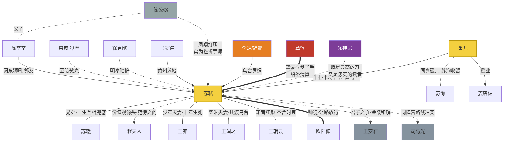

# 《一蓑烟雨》角色档案

> 双主角结构：苏轼（传奇承载）+ 巢儿（见证者锚点）｜反派体系遵循"立场之争不做脸谱化"原则

---

## 一、主要角色档案

### 苏轼 · 苏子瞻（历史主角）

| 维度 | 设定 |
|------|------|
| 年龄跨度 | 第 1 集时 19 岁（1056 进京）→ 第 50 集时 64 岁（1101 常州病逝） |
| 身份 | 眉山苏家长子 → 科场神话 → 八州太守 → 囚犯 → 东坡居士 → 翰林学士 → 天涯罪臣 |
| 性格关键词 | **赤诚**（见不得不平，如蝇在食吐之乃已）/ **谐趣**（再惨的日子也能开出玩笑）/ **不合时宜**（两头都不肯低头） |
| 核心动机 | 让治下的百姓过得好一点；把看到的真话说出来——哪怕知道代价 |
| 人物弧光 | "想用才华征服时代的天才" → "被时代碾碎后学会接住生活、并把每个流放地都活成主场的大人"。**弧光不是变圆滑，是变通透** |
| 标志性口头禅 | "有什么要紧？"（口头禅级豁达）；爱吃——每到一地先研究吃的（黄州猪肉/惠州荔枝/儋州生蚝） |
| 行为特征 | 写字必蘸浓墨；与人辩论赢了从不羞辱对方；对仆从平等相待 |
| 秘密 | 他比谁都清楚"祸从口出"的账——但每次仍选择开口。第 24 集狱中对巢儿交底："我知道会这样。可如蝇在食，吐之乃已。"（英雄主义的注脚：不是不知道怕，是知道也照做） |

### 巢儿 · 巢守拙（虚构见证者，原型糅合巢谷/马梦得等真实友人）

| 维度 | 设定 |
|------|------|
| 年龄跨度 | 小苏轼 2 岁，第 1 集时 17 岁 → 终局约 60 岁 |
| 身份变迁 | 纱縠行孤儿 → 苏家书斋杂役（偷听念书被苏洵收留）→ 书童 → 半仆半友半弟 → 黄州农事总管 → 儋州学堂助教 → 护稿人、教书先生 |
| 性格关键词 | **重诺**（一句"跟着先生"守了一辈子）/ **心细**（天才看不见的地上的坑，都是他填的）/ **自卑而倔**（总觉得功名才配得上站进先生的圈子） |
| 核心动机 | 前期："考上科举，证明自己配站在先生身边"；后期："接住先生教的活法" |
| 人物弧光 | **全剧教育意义的载体**：屡试不第的执念者 → 放下功名、在平凡中安身的传灯人。第 47 集高光镜像：学生姜唐佐中举——他自己没实现的梦，通过他教的学生实现了 |
| 标志性口头禅 | "先生，值吗？"——问科场（第 7 集）、问抗洪（第 19 集）、问乌台（第 26 集）、问流放（第 45 集）；第 50 集由他亲口给出答案 |
| 行为特征 | 怀里永远揣着一个小抄本；替先生挡酒、挡客、挡灾 |
| 秘密 | 乌台搜家前夜，他把苏轼历年诗文底稿连夜抄了三份藏于三处——这些民间私抄本后来成了元祐禁毁时期苏轼诗文流传于世的生命线。他救下的不是先生，是千年 |

---

## 二、核心配角档案

### 苏辙 · 苏子由（1039-1112）

- 性格：沉静 / 缜密 / 隐忍——与兄长互为镜像（哥哥锋利，弟弟钝厚）
- 功能：一生做兄长的安全网；官位始终比哥哥稳，捞人靠他
- 关键节点：乌台上书愿纳一切官职赎兄罪（第 25 集）；藤州相送、雷州诀别（第 46 集，兄弟最后一次见面前的天涯告别）；常州接灵、接过手稿（第 49-50 集）
- 台词基调："哥，你只管说真话。锅，我来背。"

### 三段情感线中的女性（详见"感情线设计"）

| 角色 | 生卒 | 定位 |
|------|------|------|
| 王弗 | 1039-1065 | 少年夫妻·幕后的清醒者（"幕后听言"识人） |
| 王闰之 | 1048-1093 | 柴米夫妻·共患难者（乌台搜家之夜烧稿护家） |
| 王朝云 | 1062-1096 | 知音红颜·唯一懂"一肚皮不合时宜"的人 |

### 师友群像

| 角色 | 功能 | 高光 |
|------|------|------|
| 欧阳修 | 文坛盟主·伯乐 | "老夫当避路，放他出一头地"；"三十年后，无人再道著我"（真心让路的胸怀） |
| 程夫人 | 母亲·价值观源头 | 《范滂传》之问（第 2 集）；虽在第 4 集前离世，精神贯穿全剧（范滂伏笔在第 50 集回收） |
| 马梦得（马正卿） | 同乡挚友·黄州求地人 | 苏轼自嘲"生平最穷的朋友"却在他最穷时送来一块荒坡 |
| 陈季常（陈慥） | 黄州邻友·陈公弼之子 | 河东狮吼典故担当；喜剧调味 + 父子和解线的钥匙 |
| 徐君猷 | 黄州太守 | 明奉朝廷暗护罪臣的地方官——体制内的善意样本 |
| 参寥（道潜和尚） | 诗僧好友 | 从杭州到儋州的精神同行者 |
| 张怀民 | 承天寺夜游主角 | "但少闲人如吾两人者耳" |
| 梁成 | 诏狱狱卒 | 至暗时刻里的微光：热水、洗浴、传递家书（史实人物） |
| 姜唐佐 | 儋州学生 | 海南史上首位举人；巢儿教学成果的化身 |

---

## 三、角色关系图

---

## 四、反派体系（四阶映射）

> 本剧反派设计的总原则：**没有纯粹的恶人，只有立场、恐惧与时代的绞索。** 可恨来自真实，不来自脸谱。

### Tier 1 · 炮灰型：陈公弼（活跃：第 8-9 集）

- 凤翔上司，处处打压初出茅庐的苏轼：改他的文稿、驳回他的提议、当众折辱
- **反转设计（伪反派→隐藏导师）**：多年后苏轼应其子陈季常之请为其作传，自悔年少轻狂——当年打压全是刻意磨砺。炮灰反派在第二幕以"恩人"面目完成二次退场
- 退场仪式感：第 31 集前后，黄州的苏轼写下《陈公弼传》初稿，对巢儿说："那时觉得他坏，如今才知道，肯磨你的人不多"

### Tier 2 · 中反派组合：李定 & 舒亶（活跃：第 20-27 集）

- **李定**（御史中丞）：动机合理化——早年"隐匿父丧"风波被清议唾骂，认定苏轼的诗讥刺于他；新党干将，视苏轼为旧党精神领袖必须除掉
- **舒亶**（监察御史）：告密专业户，把"逐句罗织"做成流水线——"根到九泉无曲处，世间惟有蛰龙知"被他解读为"陛下飞龙在天，轼以为不知己，而求地下之蛰龙"（史实原文级的荒诞）
- **三回合攻防战**（改造自"三回合击败模式"，因史实是惨胜而非完胜）：

| 回合 | 集位 | 战况 |
|------|------|------|
| R1 罗织定罪 | 第 21-23 集 | 弹劾连上、钦差锁拿、苏轼入狱——主角完败，威胁拉满 |
| R2 狱中攻心 | 第 24-25 集 | 昼夜审讯、诱供逼供、隔壁死囚心理施压；苏轼自撰供状认罪保家人——惨烈拉锯 |
| R3 外部翻盘 | 第 25-27 集 | 曹太后遗言压场 + 已罢相的王安石上书"安有圣世而杀才士乎"+ 神宗犹豫 → 死里逃生 |

- 退场处理：不求当场报应（尊重史实），第 27 集以"开释诏书砸在李定脸上，他脸色铁青却无可奈何"收束；他们的真正下场由历史书写——舒亶本人日后也被台谏以同样手法弹劾去职（第 43 集一笔带过的黑色幽默）

### Tier 3 · 大反派：章惇（铺垫于第 8-9 集，爆发于第 44-48 集）

- **前史（挚友期）**：凤翔时期同游，商崖题字的胆气之交——两个同样骄傲的年轻人惺惺相惜（第 9 集，埋"谁能想到"的种子）
- **转变逻辑**：绍圣年间拜相，性格中的狠辣在权力中发酵；旧账新恨叠加（元祐时苏轼曾讥其"他能杀人"旧语流传），清算元祐党人比谁都狠
- **层层加码**：贬英州 → 途中三改谪命再贬惠州（第 44 集）→ 因"子瞻""儋"字之忌再贬天涯儋州（第 46 集）→ 派董必南下察访，欲寻罪名置于死地（第 47 集，被下属彭子民苦劝"人家也有子孙"方止——刽子手的刀停在离咽喉一寸处）
- **可恨技巧运用**：背叛（曾是挚友）+ 双标（容不下别人的风骨）+ 以权力碾压弱者
- 退场仪式感：第 49 集，章惇失势被贬雷州——路过之地百姓投石泄愤；而同一时刻运河边万人争睹苏轼。**不需要一句台词审判他，画面就是判决**

### Tier 4 · 隐藏 Boss：皇权规则（具象化为宋神宗，揭露于第 40 集前后）

- **设定**：全剧真正的终极对手不是任何具体的人，而是那套"既要人才又要顺从"的系统。神宗是它的面孔——**他既是苏轼最大的保护者，又是最大的威胁**
- **三层伏笔**：

| 层级 | 集位 | 设计 |
|------|------|------|
| 第一层（不经意） | 第 6 集 | 汴京宫中，年轻的赵顼读苏轼文章拍案叫好——彼时他还不是皇帝视角的主角，观众只当路人 |
| 第二层（反常行为） | 第 25 集 | 乌台狱中，神宗深夜遣小太监探监观察苏轼睡姿——见其鼾声如雷，叹曰"心无愧怍"（史实）。观众疑惑：要杀他的人为何关心他睡得好不好？ |
| 第三层（矛盾点） | 第 33 集 | 黄州期间神宗多次欲起复苏轼均被台谏封堵，留下一句"人才实难，不忍终弃"（史实）——囚禁他的命令和舍不得他的叹息出自同一个玉玺 |
| **揭露** | 第 39-40 集 | 金陵会后王安石点破："官家爱你的才，更爱没人能挟制你。你越亮，他们越怕——这就是我当年放不下变法，也是你今日落魄的原因。"观众恍然：为什么杀不了他？为什么贬不完他？因为系统需要他活着，也需要他闭嘴 |

- 动机深度 ✓：不是贪婪嫉妒，而是权力本能与人才渴望的一体两面

---

## 五、感情线设计

### 主线：苏轼的三段情感（对应三个人生季节）

| 阶段 | 对象 | 糖虐比 | 关键节点 |
|------|------|--------|---------|
| 春·少年夫妻 | 王弗 | 7:3 | 心动：唤鱼池联句（第 3 集回忆闪现）；婚后"幕后听言"帮他识人（第 8 集）；**骤逝**（第 9 集末，第一次心碎）；隔空回响：《江城子》十年生死（第 15 集，泪点峰值①） |
| 夏·柴米夫妻 | 王闰之 | 6:4 | 再娶（第 10 集一笔带过）；乌台搜家前夜她抢先烧掉诗稿护全家——火光里巢儿抢出的残页成为他毕生珍藏（第 22 集，痛感与温情并存）；陪贬黄州种地持家（第 29 集）；病逝于苏轼起复前夜（第 41 集，未享一天福的愧疚泪点②） |
| 秋·知音红颜 | 王朝云 | 5:5 | 杭州初遇（第 13 集，歌姬唱词一眼万年）；"一肚皮不合时宜"（第 42 集，全剧人物定评时刻）；坚决随贬惠州（第 44 集）；惠州病逝，临终诵《金刚经》六如偈"一切有为法，如梦幻泡影"（第 45 集，泪点峰值③）；此后苏轼终身不复听《蝶恋花》——"枝上柳绵吹又少，天涯何处无芳草"（第 46 集一笔，余韵留白） |

### 辅线：巢儿 × 苏轼（半仆半友半弟——全剧真正的情感主轴）

- 相遇（第 2 集）：书斋窗外偷听的孤儿 → 苏轼把自己第一支毛笔给他
- 执念期（第 7-21 集）：两次落第，苏轼劝"文章千古事，功名一时荣"，他不服
- 生死期（第 23-27 集）：汴京奔走营救，平民在权力面前的渺小与滚烫
- 重生期（第 28-37 集）：东坡开垦总管，学做猪肉，第一次觉得"没有功名的日子也可以很饱"
- 传承期（第 46-50 集）：儋州学堂助教 → 护稿 → 海边教书，亲口回答自己问了先生一辈子的问题："先生，值吗？""值。"

---

## 六、名场面分布表（主要角色）

| 角色 | 名场面 | 集位 |
|------|--------|------|
| 苏轼 | 科场封神·避路放行 | 第 6 集 |
| 苏轼 | 徐州城墙·水决不能败城 | 第 18-19 集 |
| 苏轼 | 狱中诀别·与君世世为兄弟 | 第 24 集 |
| 苏轼 | 沙湖遇雨·一蓑烟雨任平生 | 第 36 集 |
| 苏轼 | 金陵会·骑驴相迎世纪和解 | 第 39 集 |
| 苏轼 | 常州临终·着力即差 | 第 50 集 |
| 巢儿 | 冷开场目送囚车（命运预告） | 第 1 集 |
| 巢儿 | 汴京奔走·平民营救 | 第 23 集 |
| 巢儿 | 夜抄三份诗稿 | 第 22 集 |
| 巢儿 | 儋州学堂·姜唐佐中举 | 第 47 集 |
| 巢儿 | 海边教书·回答"值吗" | 第 50 集 |
| 苏辙 | 上书纳官赎兄 | 第 25 集 |
| 苏辙 | 藤州相送·雷州诀别 | 第 46 集 |
| 王安石 | "安有圣世而杀才士乎" | 第 26 集 |
| 章惇 | 商崖题字（挚友期最后高光） | 第 9 集 |
| 章惇 | 失势被贬·百姓投石 vs 运河围观 | 第 49 集 |
| 朝云 | 一肚皮不合时宜 | 第 42 集 |
