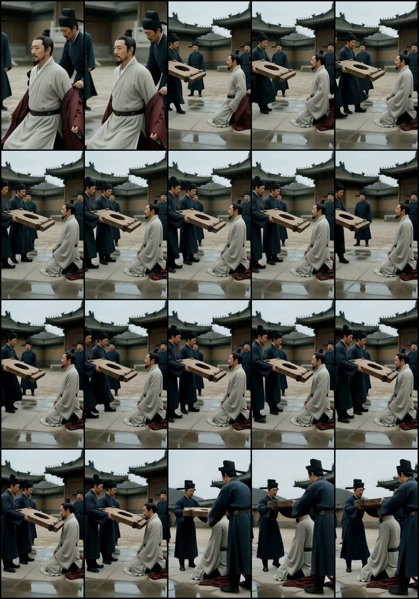

# 《一蓑烟雨》第一章跨 Panel 重复诊断

## 结论

10–15 秒不是同一视频文件被 LFO 重复加入时间线。12.271 秒是 P001 与 P002 的真实拼接点；P001 和 P002 是两个不同文件、不同哈希。问题是相邻两段都获得了同一叙事动作的“时间所有权”：上一段在结尾演完承接动作，下一段又从相近的更早状态重新演一次。

这是一项生产流程缺陷，而不是单个 seed 偶发失败。缺陷由四层共同形成：

1. 故事板层把共享首格写成“复现木枷逼近”“复现巢儿入场”等有时长、有动作的镜头。
2. H3 提示词层再次为共享首格分配 1.0–3.9 秒，并使用 `reproduce <Picture 1> exactly` 后继续重复上一动作。
3. 执行层使用 `video.reference_to_video`，把真实末帧绑定为普通 `ref_image_0`；这是语义参考，不是模型输入的硬首帧。
4. 组装层读取每个通过片段的完整实际时长并直接拼接，没有 source-in/source-out 或“共享镜头只保留一次”的规则。

因此，模型既被要求重建上一末态，又被要求从该末态附近继续动作；R2V 无法保证第 0 帧等于真实末帧，常会把人物或道具退回一点再向前运动，形成肉眼可见的“倒带—重演”。

## 10–15 秒逐帧定位

分析源：最终成片 10.000–15.000 秒，4 fps 抽帧。接触表按从左到右、从上到下阅读，每格约 0.25 秒：



- 10.000–约 10.500 秒：苏轼已经只穿灰白中衣跪地，差役和木枷进入侧面构图。
- 约 10.500–12.250 秒：P001 中木枷持续靠近，已经来到苏轼肩前半步左右。
- 12.271 秒：P001→P002 硬切。
- 约 12.500–14.000 秒：画面维持同场景、同机位、同人物关系，但木枷与差役的位置发生轻微回退，再次完成“走近、举枷”。
- 约 14.000 秒后：才进入真正的新动作——木枷抬向肩颈、机位开始变化。

对应文本证据：

- P001 Shot 6 从 10.400 秒开始，要求差役抬木枷靠近，并在离苏轼肩部半步处停下。
- P002 Shot 1 又从 0.000–1.500 秒要求“复现 Picture 1”，且差役再向苏轼走一步。
- 故事板 P002 左上格直接写为“复现木枷逼近”。

所以这里不是“同一段素材重复”，而是“两个独立生成片段分别表演了同一动作”。

## 全片边界审查

每张边界图第一排为前一 Panel 最后约 2 秒，第二排为后一 Panel 最初约 2 秒。

| 边界 | 实际表现 | 类型 | 严重度 |
| --- | --- | --- | --- |
| P001→P002 | 木枷已靠近，切后轻微回退并再次靠近、抬起 | 动作倒带重演 | 高 |
| P002→P003 | 巢儿已经挤出人群迈步，切后又从人群方向重新迈出 | 动作重演 | 高 |
| P003→P004 | 御史说完“写诗”后的闭嘴持诏状态在两段各停留一次 | 静态末态双重停留 | 中 |
| P004→P005 | 囚车已经沿中轴远去，切后尺度/位置近似回退，再次远去 | 位移重置 | 中高 |
| P005→P006 | 巢儿奔跑、伸手和“先生——”尾音跨两段重复延长 | 动作与声音重叠 | 中高 |
| P006→P007 | P006 末尾黑场 2.5 秒，P007 开头又安排黑场 2.5 秒；实片连续纯黑约 4.58 秒 | 转场由两边重复持有 | 高 |
| P007→P008 | 苏轼已开始起身，切后再次从相近较低姿态完成起身 | 动作延续发生回退 | 中 |
| P008→P009 | 窗沿上方眼睛、挑眉和提问末态继续被保持 | 构图/反应双重停留 | 中 |
| P009→P010 | 巢儿回答后的近景姿态跨边界继续停留，下一有效反应延迟 | 静态信息重复 | 中 |
| P010→P011 | P010 已握手并开始拉起巢儿；P011 开头巢儿重新坐低，再次握手起身 | 明显动作倒带重演 | 很高 |
| P011→P012 | 笔尖已下降并触纸，切后再次保持/完成同一次落笔 | 道具动作重演 | 中高 |

关键证据图：

- [P001→P002 木枷边界](assets/qc/boundary_P001_P002.jpg)
- [P002→P003 巢儿入场边界](assets/qc/boundary_P002_P003.jpg)
- [P010→P011 握手起身边界](assets/qc/boundary_P010_P011.jpg)
- [P011→P012 笔尖落纸边界](assets/qc/boundary_P011_P012.jpg)

P002–P012 的提示词给共享首态共分配了约 23.2 秒。这个数是“重复风险窗口”，不等于每一秒都必须删除，但它说明约 14% 的计划时长被用于再次建立上一段已经建立的状态。

## 根因分层

### 1. 根因：共享 Shot 没有唯一的时间所有者

正确设计应是：P001 拥有并播放 S006；P002 的第一格只引用 S006 的可见末态，真正的新时间从 S007 开始。

当前设计却是：P001 播放 S006，P002 又把 S006 当作一个完整的首镜播放。S011、S016、S021、S026、S031、S036、S041、S046、S051、S056 同样如此。

`zero-to-story` 的现行规则已经明确：后一 Panel 第一格只承接可见末态，不引入新动作。当前项目的故事板和提示词没有遵守这一语义。

### 2. 放大器：R2V 参考图被误当成硬首帧锁

当前执行包把上一段真实末帧标为 `continuity.exact_previous_last_frame`，但仍使用：

```text
operation: video.reference_to_video
placement: fixed
slot: ref_image_0
```

本地后端会把该 operation 选择为 `h3_standard_r2v`。只有 `video.image_to_video` / `video.first_last_frame` 路径会把图片真正接到 H3 节点的 `first_frame` / `last_frame` 输入。

所以当前所谓 “last-frame lock” 实际只是高优先级视觉参考。模型会尽力重建，而不是从像素完全一致的 frame 0 向前运动。重建误差一旦发生在运动方向上，就表现为人物、木枷、囚车、手或毛笔先退后进。

### 3. 放大器：提示词要求“复现”且给足表演时间

例如：

- P002 首镜 1.5 秒再次走近。
- P003 首镜 3.0 秒再次挤出人群。
- P005 首镜 2.4 秒再次展示囚车远离。
- P006 首镜 2.2 秒再次跑和喊。
- P011 首镜 3.9 秒再次完成握手起身。

长 Panel 本身不是问题；问题是增加的时长被用于稳定停留和重演。尤其 P010 末尾已经要求握手/起身并保持 3 秒，P011 开头又安排 3.9 秒，导致同一情节在切点两侧获得近 7 秒的视觉占用。

### 4. 最终保留器：组装没有入点/出点

组装包对每个通过片段采用 `video.passthrough`，`duration_ms` 取源文件完整实际时长。没有裁掉后一段的共享首镜，也没有声明哪个片段拥有黑场、对白尾音或同一动作。于是上游所有重叠都原样进入最终片。

### 5. QC 漏项：检查了“像不像”，没有检查“时间是否前进”

当前 QC 能发现身份漂移、道具错误和开场完全不接，但相邻画面很相似时容易判为“连续性好”。实际上，连续性必须同时满足：

- 空间连续：人物、道具、轴线合理；
- 状态连续：下一帧不回到更早状态；
- 时间连续：已完成动作、对白和转场不再执行第二遍。

此前逐 Panel QC 主要看当前片自身和尾帧，没有固定生成“上一段最后 2 秒 + 下一段最初 3 秒”的联合审片素材，所以跨段动作倒带没有成为硬失败。

## 修改方案

### A. 修正故事板与 Panel 时间契约（必须）

保留 2×3 六格版式，但把后一 Panel 左上格定义为“零时长连续性锚点”，而不是第一个可播放动作：

```yaml
boundary_anchor:
  inherited_shot: S006
  playback_duration_ms: 0
  inherited_state: 木枷已在苏轼肩前半步，差役双脚已停
  first_new_shot: S007
  first_new_action: 两名差役立即垂直抬枷对准颈部
  forbidden_replay:
    - 差役再次从远处走近
    - 木枷与苏轼距离增大后再缩小
    - 再次脱袍
```

规则：

1. P001 六格均拥有播放时间；P002 起每个 Panel 只有五个新增叙事节拍拥有时间。
2. 重叠 Shot 只由前一 Panel 播放一次。
3. 黑场、溶解、对白尾音和定格必须指定唯一 `temporal_owner`，不能由切点两侧各持有一次。
4. 目标总时长按“唯一叙事时间”计算，不能把共享 Shot 再计入下一 Panel。

### B. 按边界类型选择 H3 模式（必须）

不要一律用 R2V 接力。

**同一镜头连续运动**：使用 I2VA。

- operation：`video.image_to_video`
- 上一段真实末帧：`placement: first`、`slot: first_frame`
- frame 0 是上一真实末帧；0.000 秒立即开始新微动作。
- 提示词明确禁止逆向位移、动作重演和建立性停顿。

**已有批准终帧且全段适合连续单镜**：使用 FL2VA。

- operation：`video.first_last_frame`
- 首尾图分别绑定 `first_frame`、`last_frame`
- H3 指南更适合单镜连续插值；不建议用一个 FL2VA 段承载频繁六次切镜。

**切点本来就应换景别/换视点**：可继续使用 R2V，但下一 Clip 直接从新 Shot 开始。

- 不要求它在前 1–4 秒重建上一末帧。
- 上一尾帧只作人物/轴线参考，或完全不进入新画面。
- 通过硬切、匹配切、J-cut/L-cut 保持电影连续性。

当前后端的 FL2VA/I2VA 路径不会像 R2V 一样消费整套多图身份/分镜参考。因此应采用混合策略：需要像素连续时优先真实首帧；需要多参考和新构图时，选择明确硬切，不再假装它是同一连续镜头。

P002 的 I2VA 开头应表达为：

```text
For the target video, at 0.00 seconds into the target video, <Picture 1> (from [Shot 1]) is fully referenced.

integrated_multimodal_description: [Shot 1] Live-action, cinematic. Frame 0 is the exact accepted P001 final frame. The guards' feet are already stopped and the cangue is already half a step from Su Shi's shoulders. At 00:00.000 they immediately lift the cangue vertically toward neck height; by 00:00.300 the new upward movement is unmistakable. The cangue never moves farther away, the guards never take another approach step, and no prior action is replayed.
```

这是改写方向示例，不是完整投产提示词；正式修订仍应由 `h3-prompt-writing` 输出完整结构。

### C. 给组装增加边界裁切能力（短期修片必须，长期应进入契约）

对现有素材，先按下一 Panel 的首镜区间做候选 head trim，再逐帧选真正的新动作入点：

| 后一 Panel | 提示词首镜风险区间 | 推荐初始检查点 |
| --- | ---: | --- |
| P002 | 1.5s | 从木枷开始垂直抬升处进入 |
| P003 | 3.0s | 从长枪开始交叉拦截处进入 |
| P004 | 1.2s | 从巢儿眼睛反应切入 |
| P005 | 2.4s | 从囚车内主观或新的景别进入 |
| P006 | 2.2s | 去掉重复追喊，从下一新镜进入 |
| P007 | 2.5s | 至少去掉约 1.5s 重复纯黑，让 dissolve 立即开始 |
| P008 | 2.0s | 从推窗的新动作进入 |
| P009 | 1.4s | 从门声/门口揭示进入 |
| P010 | 2.1s | 从苏洵反应/转身进入 |
| P011 | 3.9s | 去掉二次起身，从握手到毛笔的匹配切进入 |
| P012 | 1.0s | 去掉二次落笔，从抬笔/指腹描画进入 |

这些时间来自提示词，不应机械批量裁切；H3 实际动作时点会漂移，必须用真实帧选点。若全部按名义首镜裁掉，成片约减少 23.2 秒，仍有约 139 秒，满足 100+ 秒目标。

长期方案是在公共执行包/时间线引入 `source_in_ms`、`source_out_ms` 或等价的已修复派生片段机制，并同步更新字幕和音频偏移。当前没有该能力时，应先生成可追溯的 trimmed derivative，再交给 assembly，不覆盖原始通过片段。

### D. 新增跨边界 QC 闸门（必须）

每接受下一 Panel 前自动生成：

```text
previous accepted tail 2s + candidate next head 3s
```

视频理解逐项回答：

1. 前段最后可见状态是什么？
2. 后段第一帧是否回到更早状态？
3. 同一动作、台词、黑场或反应是否出现两次？
4. 人物/道具沿运动方向是否单调前进？
5. 切后 0.4 秒内是否出现新的动作或新信息？

建议硬失败条件：

- 已完成动作发生明显回退并再次执行；
- 同一句对白或同一可辨动作跨边界完整出现两次；
- 非明确导演设计的静态锚点超过 0.8 秒；
- 相邻两段共同持有的纯黑/定格超过 0.6 秒；
- 道具距离、人物高度、车体位置或手势状态回到更早阶段。

MiMo 对本次较长和切点短片的调用出现 `finish_reason=length`/空内容，因此没有把空结果当成判断依据。本报告的语义结论以 4 fps 密集接触表、11 个边界的两侧联合抽帧、实际提示词、执行包和后端路由代码交叉验证。后续 QC 应保留模型失败回退：视频模型无有效输出时，自动转为高密度逐帧画布审查，而不是静默通过。

## 推荐实施顺序

1. 先对现有 12 段做 frame-accurate head trim 试剪，重建一版“去重剪辑版”，进行完整连续观看。
2. 对裁切后仍发生动作跳跃的边界，只重生成后一 Panel；优先 P002、P003、P005/P006、P011。
3. 重写 storyboard 中所有“复现……”为零时长 `boundary_anchor`，同时写清 `first_new_action` 和 `forbidden_replay`。
4. 依边界选择 I2VA 或 R2V，不再把 R2V 普通参考图称为硬首帧锁。
5. 把联合边界 QC 设为下一段尾帧可被接力前的硬闸门。

完成这五步后，10–15 秒的木枷重复和全片同类问题会从流程上被消除，而不是依赖换 seed 碰运气。
