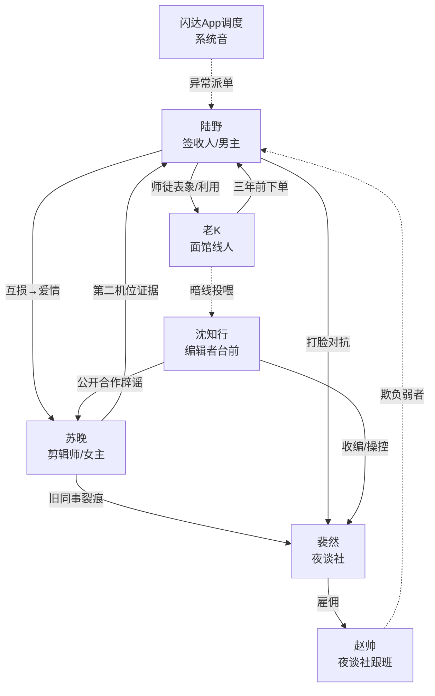

# 角色档案 · 《午夜不接单》

---

## 1. 主要角色档案

### 陆野（男主）

| 项 | 内容 |
|----|------|
| 姓名 | 陆野 |
| 年龄 | 27 |
| 身份 | 澄海「闪达跑腿」夜班骑手；前短视频吐槽博主（已弃号） |
| 性格关键词 | 嘴贱清醒、怂得诚实、讲义气 |
| 核心动机 | 先求「别出事、能赚钱」；后求「揭穿规则、保护被卷进来的人」；最终求「有权拒单」 |
| 人物弧光 | 杠精拆穿党 → 被迫守规则的签收人 → 主动选择是否接单的见证者 |
| 标志特征 | 头盔永远歪戴；遇事先回：「差评我认，命我还想要。」接单前习惯念三遍备注（喜剧护身符） |
| 秘密 | 三年前送丢「空白收件人」那一单后，短暂失忆半天；弃号是因为那晚直播突然弹幕全是同一句规则 |

---

### 苏晚（女主）

| 项 | 内容 |
|----|------|
| 姓名 | 苏晚 |
| 年龄 | 25 |
| 身份 | 民俗/怪谈类短视频剪辑师；频道「澄海夜谈」前主创（已退出） |
| 性格关键词 | 毒舌细心、外冷内怯、执拗 |
| 核心动机 | 用镜头「归档」传说，证明它们可被记录、可被对抗；私下想找到失踪的前搭档 |
| 人物弧光 | 把陆野当素材/工具人 → 并肩求生的同伴 → 坦白隐瞒后重获信任，成为「第二机位」真相的钥匙 |
| 标志特征 | 永远背双机位相机包；紧张时修音频降噪当解压；口头禅：「别演，镜头比你诚实。」 |
| 秘密 | 素材库里藏着「第二机位」——三年前雨夜走廊的画面，拍到的送件人背影是陆野；她一直没敢告诉他 |

---

### 老K（关键同盟 / 灰色角色）

| 项 | 内容 |
|----|------|
| 姓名 | 柯慎（对外只称老K） |
| 年龄 | 42 |
| 身份 | 自称「澄海怪谈局」编外联络人；白天开通宵面馆 |
| 性格关键词 | 温和、话半句、烟味重 |
| 核心动机 | 表面：压住传说扩散；真实动机见 Tier 4 |
| 人物弧光 | 可靠导师感 → 嫌疑对象 → 面具揭开后仍留下一句真话：「我拦过你，也推过你。」 |
| 标志特征 | 永远递两碗面：一碗给你，一碗「给路上的」；口头禅：「先吃面，再谈鬼。」 |
| 秘密 | 怪谈局编制根本不存在；他是「规则投喂」链条上的养育者，也是三年前那一单的下单人 |

---

### 裴然（Tier 2 中反派）

| 项 | 内容 |
|----|------|
| 姓名 | 裴然 |
| 年龄 | 29 |
| 身份 | 网红团伙「夜谈社」社长；流量操盘手 |
| 性格关键词 | 精致利己、表演型自信、怕掉粉 |
| 核心动机 | 用都市传说制造「真实恐吓」内容吸金；认定陆野是可收编的「真人素材」 |
| 标志特征 | 直播必说：「家人们，这可不是演的。」失败时砸提词器 |
| 秘密 | 最早的「吓人脚本」并非他原创，而是从一个匿名文档库抄的——库的管理员指向编辑者网络 |

---

### 沈知行（Tier 3 台前大 Boss）

| 项 | 内容 |
|----|------|
| 姓名 | 沈知行 |
| 年龄 | 38 |
| 身份 | 城市文化顾问 / 平台「城市故事」栏目总监；公众面前的理性辟谣者 |
| 性格关键词 | 从容、文雅、残忍冷静 |
| 核心动机 | 让澄海成为「活着的传说之城」以掌控注意力经济与规则解释权；视陆野为最优签收人 |
| 标志特征 | 永远捧手冲咖啡；对媒体说：「传说是城市的免疫系统。」 |
| 秘密 | 他能改规则措辞，但不能凭空创造——创造权在更上层的「投喂者」 |

---

## 2. 角色关系图

**关系类型标注**

| 关系 | 类型 |
|------|------|
| 陆野 ↔ 苏晚 | 爱情（互损甜）+ 同盟 |
| 陆野 ↔ 老K | 师徒表象 → 利用 / 仇恨纠葛 |
| 陆野 ↔ 裴然 | 仇恨 + 打脸对抗 |
| 苏晚 ↔ 裴然 | 旧同盟破裂 / 利用 |
| 裴然 ↔ 沈知行 | 利用（上对下） |
| 老K ↔ 沈知行 | 暗线同盟（投喂链） |
| 陆野 ↔ 闪达系统 | 异常派单（规则接口） |

---

## 3. 反派四阶体系

### Tier 1 炮灰：赵帅 + 「差评姐」金婷

| 项 | 赵帅 | 金婷 |
|----|------|------|
| 身份 | 夜谈社跟班摄像 | 高端小区常客，惯用差评威胁骑手 |
| 出场 | Ep2–3 | Ep1（社死开场）、Ep4 |
| 退场 | Ep7：直播整蛊反被规则反噬，社死出圈 | Ep5：差评威胁撞上真规则，吓到删评道歉 |
| 功能 | 建立打脸模板；引出夜谈社 | 喜剧开场锚点；展示陆野怂而嘴硬 |
| 关联上级 | 裴然 | 无（纯社会炮灰） |

**对白风格（T1）**：「你算哪根葱？配合拍就有流量。」

---

### Tier 2 中反派：裴然（三回合击败）

| 回合 | 集数 | 结果 | 事件 |
|------|------|------|------|
| R1 | Ep12–14 | 陆野吃亏 | 裴然伪造「陆野装神弄鬼」视频，平台封号警告；苏晚被迫切割 |
| R2 | Ep18–20 | 势均力敌 | 陆野用真实送达记录打假；夜谈社掉粉但仍握住第四条传说脚本 |
| R3 | Ep24–26 | 陆野胜出 | 当众揭穿夜谈社「害人取景」；裴然被平台封杀，退场名场面：黑暗直播间里对着黑屏说「家人们……还在吗」 |

**动机合理性**：流量是命；他怕的不是鬼，是凉。  
**可取之处**：内容嗅觉极强，若走正经纪录路线本可成功。  
**关联 Tier 3**：脚本库与「真实事故」资源来自沈知行的匿名渠道。

**对白风格（T2）**：「你很适合出镜，可惜站错边了。」

---

### Tier 3 大 Boss：沈知行（层层揭露）

| 阶段 | 集数 | 揭露内容 |
|------|------|---------|
| 铺垫 | Ep15、Ep21 | 以辟谣专家身份上节目，话术异常正确 |
| 轮廓 | Ep28–32 | 老K危机后，线索指向「城市故事」栏目资源调度 |
| 半明牌 | Ep40–45 | 笔记暴露：宿主栏、规则版本号；陆野被迫公开转述 |
| 对决 | Ep49–55 | 掌控规则解释权，逼陆野成为永久签收人 |

**威胁维度**：舆论（辟谣话语权）+ 规则措辞权 + 情感（利用苏晚的「归档理想」）。  
**魅力点**：从不吼叫；越温和越可怕。

**对白风格（T3）**：「在澄海，恐慌和信任都是可调度的资源。」

---

### Tier 4 隐藏 Boss：老K（柯慎）

| 伏笔层 | 位置 | 设计 |
|--------|------|------|
| 第一层 | Ep5–8 | 面馆多一碗面；「给路上的」——观众当怪癖 |
| 第二层 | Ep22–28 | 关键夜「正好不在」；陆野遇险时他电话占线 |
| 第三层 | Ep40–48 | 怪谈局证明造假；他的旧手机号=三年前下单号 |
| 揭露 | Ep56 | 面具揭开：沈知行是「编辑」，老K才是「投喂者」；培养陆野是为续写澄海 |

**动机深度**：他相信没有传说的城市会死于冷漠；用可控恐慌「养活」澄海的故事——扭曲的城市守护欲。  
**反差**：始终温和慈祥：「别担心，吃完这碗，一切都会过去的。」

**与开放结局衔接**：老K计划被打断，但投喂逻辑未死；最后空白订单，像他留下的习惯句式。

---

## 4. 感情线设计（陆野 × 苏晚）

### 进展时间线

| 阶段 | 集数 | 节点 | 状态 |
|------|------|------|------|
| 相识 | Ep3–6 | 苏晚找陆野买「真实素材」；互损（素材侠 vs 杠精骑手） | 火药味 |
| 心动 | Ep11–15 | 共守一条规则；陆野用差评回复体念规则逗她笑，她却认真挡在他身前 | 心动 |
| 暧昧 | Ep19–23 | 雨夜共用一把伞却吵「该不该回头」；差一点点牵手被订单打断 | 暧昧 |
| 误会/分离 | Ep35–38 | 第二机位与「早知情」爆发；苏晚失联（Ep22 伏笔回收加深） | 虐 |
| 重逢/并肩 | Ep46–50 | 至暗后重逢；坦白秘密，选择一起拒做宿主 | 重逢 |
| 在一起（克制） | Ep58–60 | 不告白大会；用「暂停接单」并排挂标识收束；开放式留白 | 轻糖收束 |

### 糖虐比例
**糖 : 虐 ≈ 6.5 : 3.5**（喜剧主类型；虐集中在 Ep22、Ep36–38，不拖长刀）

### 关键情感节点标记
- 💕 Ep14 心动：规则倒计时里互损变护短  
- 💕 Ep23 差点牵手被订单打断（喜剧）  
- 💕 Ep37 决裂名场面（付费墙情绪）  
- 💕 Ep49 重逢：一句「这单我送，你别回头」

---

## 5. 角色名场面（所在集数）

### 陆野
1. **Ep1** — 社死送错单，被骂「活在都市传说里」后接到真规则备注  
2. **Ep10** — 拆开写有自己全名的第七条规则草稿（第一道付费墙）  
3. **Ep26** — 当众拆穿夜谈社，用送达轨迹打脸裴然  
4. **Ep48** — 意识坠入传说空间，现实手机亮起「请确认送达」  
5. **Ep60** — 挂上「暂停接单」，面对空白订单不点开/或点开前定格（开放）

### 苏晚
1. **Ep6** — 剪辑时发现第二机位里的陆野背影，手抖删到回收站又找回  
2. **Ep22** — 失联前语音：「别接……最后一单」  
3. **Ep36** — 被质问「你从一开始就知道？」泪落，门被推开  
4. **Ep49** — 带着完整第二机位原片回归  
5. **Ep58** — 拒绝再为沈知行做「归档美化」

### 老K
1. **Ep5** — 递面：「先吃面，再谈鬼。」  
2. **Ep28** — 疑似被规则反噬的倒计时（真假之后揭晓）  
3. **Ep56** — 温和揭面：「我拦过你，也推过你。」

### 裴然
1. **Ep16** — 直播即将公开「跑腿员就是载体」  
2. **Ep26** — 黑屏直播间名场面退场  

### 沈知行
1. **Ep21** — 电视辟谣金句：「传说是城市的免疫系统。」  
2. **Ep45** — 迫使陆野当众转述新规则  
3. **Ep55** — 终局对峙：咖啡凉了也不放下杯子  

---

## 6. 配角速查（功能性）

| 角色 | 功能 | 主要出场 |
|------|------|---------|
| 站长周姐 | 陆野职场缓冲/吐槽搭档 | 贯穿日常场 |
| 前搭档阿芒（失踪） | 苏晚心结；传说受害者线索 | Ep8 起提及，Ep40 前后回收 |
| 闪达「系统音」 | 异常派单的规则接口；喜剧拟人感 | 关键订单节点 |
| 金婷 | T1 炮灰喜剧 | Ep1、Ep4–5 |
| 赵帅 | T1 炮灰打脸 | Ep2–7 |
