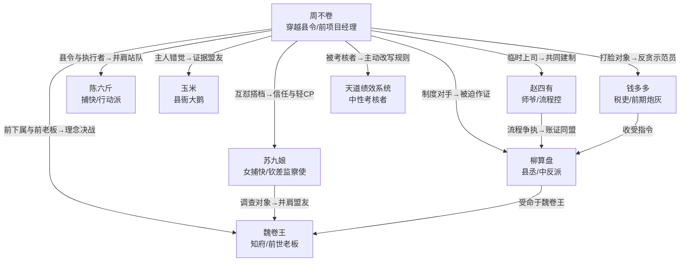

# 角色档案 · 我只想摆烂，怎么成了天下第一

> 核心关系：一名只想下班的穿越县令，一名不肯盲从的女钦差，一群被绩效报表耽误的人，共同把“会做事”改造成“让所有人都能参与做决定”。

## 一、主要角色

### 1. 周不卷

| 项目 | 设定 |
|---|---|
| 年龄 | 29 岁 |
| 身份 | 前世是互联网公司的项目经理；今生是大岚朝平水县七品县令 |
| 性格关键词 | 省电、毒舌、心软 |
| 核心动机 | 表层是完成 30 天考核、回现代并彻底摆脱加班；深层是证明人的价值不该由一张漂亮报表决定 |
| 人物弧光 | 从“只做最低成本的保命方案”变成“建立一套不依赖救世主、能让普通人说话的规则” |
| 口头禅 | “这个问题不急，先下班。” |
| 行为特征 | 遇到危机先看沙漏和人力成本；随身拿一块旧工牌当扇子；说完狠话后总会悄悄补漏洞 |
| 秘密 | 前世曾替魏卷王签过一份“满意度算法”报告，知道漂亮数据可以掩盖真实痛苦，因此本能地不相信任何只看数字的系统 |

周不卷不是天才型救世主，他的优势是能迅速拆解问题、找到最低成本的解决路径，并且在关键时刻愿意承担别人不愿承担的责任。喜剧感来自他的理性和古代环境的完全错位：他越想把事情做成“流程”，现实越把他推到荒唐的临场救火里。

### 2. 苏九娘

| 项目 | 设定 |
|---|---|
| 年龄 | 27 岁 |
| 身份 | 表面是平水县女捕快；真实身份是奉密旨查税案的钦差监察使 |
| 性格关键词 | 冷面、利落、疑心重 |
| 核心动机 | 查清平水县粮税失踪案，证明自己能独立判断，而不是只做上级命令的执行者 |
| 人物弧光 | 从“只相信证据和命令”变成“既相信证据，也相信普通人对自身生活的判断” |
| 口头禅 | “先别解释，跟我走。” |
| 行为特征 | 进屋先数出口，听到黑话就拔刀，紧张时会把捕快腰牌转三圈 |
| 秘密 | 她的父亲曾因魏卷王伪造的政绩报告被贬，真正的家产也被卷入粮税黑账；她接下密旨，最初带着私人复仇意图 |

苏九娘与周不卷是轻量 CP 线，不走浓烈虐恋，而走“互相抓捕、互相救场、最后互相授权”的搭档关系。她是第一个能看穿周不卷“装废物”外壳的人，也是第一个要求他不要一个人扛下所有问题的人。

### 3. 赵四有

| 项目 | 设定 |
|---|---|
| 年龄 | 36 岁 |
| 身份 | 平水县师爷，兼任账房、文书、临时厨子和大鹅饲养员 |
| 性格关键词 | 流程控、嘴碎、怕事 |
| 核心动机 | 起初只想保住俸禄和饭碗；后来想让县衙第一次拥有一套不靠拍脑袋运转的规矩 |
| 人物弧光 | 从“把所有事写成公文就算完成”变成“让规则真的服务于人” |
| 口头禅 | “按流程来，流程不会打人。” |
| 行为特征 | 打架时仍坚持做会议纪要；别人说一句话，他能自动拆成三项待办；从袖口里掏出永远写不完的账册 |
| 秘密 | 他知道前任县令并非主动贪墨，而是被魏卷王逼着修改账目；他一直保留着一份没有盖章的原始账页 |

赵四有是主角方案落地的关键。他负责把周不卷的现代术语翻译成古代人听得懂的话，经常翻译错，但错得刚好能推动剧情。

### 4. 陈六斤

| 项目 | 设定 |
|---|---|
| 年龄 | 31 岁 |
| 身份 | 县衙捕快，平水县最有力气、最没心眼的执行者 |
| 性格关键词 | 仗义、憨直、护短 |
| 核心动机 | 领到稳定俸禄给母亲治病，不再被上级随意扣钱 |
| 人物弧光 | 从“谁给钱就听谁的”变成“知道什么事值得站出来” |
| 口头禅 | “大人，我没打人，是他自己撞我手上。” |
| 行为特征 | 永远带着半个馒头；负责把周不卷的白板扛到任何冲突现场；紧张时会把门框捏出手印 |
| 秘密 | 他其实识字，只是不想让人知道，因为识字的捕快经常被抓去做更多工作 |

陈六斤承担动作喜剧和情感落点。他第一次主动读出公告，是全剧“普通人开始拥有规则”的小高潮。

### 5. 玉米

| 项目 | 设定 |
|---|---|
| 年龄 | 2 岁，按鹅的年龄计算 |
| 身份 | 县衙大鹅，前任县令留下的唯一“固定资产” |
| 性格关键词 | 记仇、贪吃、行动力过强 |
| 核心动机 | 任何时候都要吃到最好的粮食，并对所有拿账本的人发动追击 |
| 人物功能 | 视觉笑点、危机触发器、证据搬运工 |
| 标志行为 | 叼走关键纸张、撞翻严肃仪式、在最不该出现的地方发出叫声 |
| 秘密 | 它曾经吃掉过魏卷王的一角公文，因此对魏卷王的气味有本能敌意 |

玉米不承担拟人化对白。它的“台词”只用叫声、扑翅和动作完成，并在第 8、9、24、29 集回收关键道具功能。

## 二、反派体系

### Tier 1：钱多多（前期炮灰）

| 项目 | 设定 |
|---|---|
| 身份 | 县衙税吏，负责粮税登记和临时搜查 |
| 性格关键词 | 欺软怕硬、贪小便宜、嘴硬 |
| 动机 | 靠虚报粮税和收取“加急费”还赌债；他不相信任何人会真的保护百姓 |
| 活跃区间 | 第 1–5 集 |
| 反派台词 | “规矩就是规矩，除非有人给我换一套规矩。” |

**处理方式：**

- 第 2 集：带人没收百姓的最后一袋米，第一次与周不卷正面冲突。
- 第 4 集：伪造投诉工单，试图证明新制度无效。
- 第 5 集：公开对账时被周不卷用他自己的收条当场拆穿，钱多多跪在粮仓门口承认“每一笔都记得很清楚”。

退场后不彻底消失，改为被迫担任“反贪示范员”，每次看见账本就条件反射地发抖，保留喜剧价值。

### Tier 2：柳算盘（中反派）

| 项目 | 设定 |
|---|---|
| 身份 | 平水县县丞，实际掌控地方人情、粮道和文书流程 |
| 性格关键词 | 精明、圆滑、守旧 |
| 核心动机 | 他相信一个穷县只能靠灰色规矩维持运转，自己收取的好处大部分用于养活一批失去土地的乡亲；他把“腐败”当成一种不体面的救济 |
| 活跃区间 | 第 6–16 集 |
| 反派台词 | “周大人，理想可以不花钱，粮食不行。” |
| 可取之处 | 熟悉地方人情和行政漏洞，确实有很强的执行力；如果不走歪路，他会是最好的县政管家 |

#### 三回合击败设计

| 回合 | 集数 | 结果 | 戏剧功能 |
|---|---:|---|---|
| 第一回合 | 8–9 | 柳算盘调走粮册、买通证人，周不卷虽然保住性命，却丢失关键账页 | 建立中反派威胁，第一道付费墙后快速回报但不彻底胜利 |
| 第二回合 | 12–13 | 周不卷用轮班和公开账本堵住漏洞，柳算盘却利用百姓对新政的不适制造混乱，双方势均力敌 | 展示主角成长，也承认柳算盘确实懂地方治理 |
| 第三回合 | 15–16 | 苏九娘找到原始账页，周不卷让柳算盘公开解释每一笔“救济费”；柳算盘发现魏卷王才是最大受益者，选择作证 | 主角胜出，敌人退场同时暴露更高层反派 |

退场名场面：柳算盘被要求第一次按公开标准领取俸禄，发现自己每月反而多了两文钱。他沉默片刻，说：“原来不贪也能活。”然后主动把藏在鞋底的账本交出来。

### Tier 3：魏卷王（大反派/终极对手）

| 项目 | 设定 |
|---|---|
| 年龄 | 42 岁 |
| 身份 | 大岚朝巡察知府；真实身份是周不卷前世的直属老板魏总，也是更早穿越的人 |
| 性格关键词 | 克制、好胜、极度擅长组织 |
| 核心动机 | 他相信混乱只能靠指标、排名和惩罚来消除；前世被绩效系统淘汰后，他要在古代证明“只要把数字做漂亮，所有人都会服从” |
| 活跃区间 | 第 8 集起铺垫，第 14 集后全面主导，第 27–29 集完成揭露和决战 |
| 反派台词 | “人可以撒谎，数字不会。至于数字是谁写的，不重要。” |
| 可取之处 | 执行力极强、记忆力惊人、确实能在短期内调动大量资源；他最可怕的地方不是无能，而是太相信自己的方法 |
| 核心弱点 | 把人当变量，不相信没有排名的合作；一旦报表无法解释真实生活，就失去判断力 |

#### 三阶段对抗

1. **第 8 集：规则碾压。** 他用知府公文和禁卫队打断公开查账，令周不卷暂时成为“伪造国库文书”的嫌犯。
2. **第 14–21 集：舆论和资源碾压。** 他切断粮道、制造满意度造假舆论，让县民误以为周不卷的新政只会带来麻烦；周不卷只能靠县民互助勉强撑住。
3. **第 27–29 集：身份和理念决战。** 他承认自己是魏总，拿出一份“平水县满意度 99 分”的完美报表，要求所有人接受结果；周不卷用公开述职和县民真实证言击穿这份报表。

退场名场面：魏卷王被县民依法投票罢免，仍想发表一段总结。赵四有递给他一张纸：“发言限时三分钟。”魏卷王第一次因为没有足够时间做 PPT 而沉默。

### Tier 4：隐藏 Boss配置

本剧不设置独立的隐藏 Boss。所谓“天道绩效系统”是中性评估者，不是幕后反派；第 27 集看似发布残酷任务，最终目的是验证周不卷是否愿意放弃个人英雄主义。这样能让终局反转服务主题，而不是在 30 集末尾再增加一个新敌人。

## 三、角色关系图

## 四、轻感情线设计

感情线占比约 20%，糖虐比例约 7:3，主要承担信任和共同决策，不抢主线喜剧。

| 节点 | 集数 | 关系变化 |
|---|---:|---|
| 初识 | 2 | 苏九娘把周不卷当成装疯卖傻的嫌疑人，第一次见面就要把他带走 |
| 被迫合作 | 7–10 | 两人用“你负责拔刀，我负责省钱”的方式查粮案，第一次互相补位 |
| 信任断裂 | 18 | 苏九娘亮出钦差令，当众宣布要押周不卷进京，关系停在最高悬念点 |
| 真相后并肩 | 19–24 | 她承认父亲旧案，周不卷也承认自己曾经替绩效报告作假，两人交换秘密 |
| 主动授权 | 28 | 周不卷把最后的决定权交给县民，苏九娘没有替他下令，而是说“这次我听他们的” |
| 喜剧式确认 | 30 | 两人共同申请每月一天“无案休息日”，县民批准，玉米当场叼走申请表 |

## 五、角色关键场景

### 周不卷

- **第 1 集：** 刑场上把遗言说成加班申请，醒来即面对罢免大会。
- **第 5 集：** 用钱多多自己的收条公开对账，第一次让全县相信他不是来捞钱的。
- **第 12 集：** 在魏卷王面前把“站着开会”解释成提高决策效率，实际上全员都累得快晕倒。
- **第 21 集：** 主动背下篡改国策的罪名，给县民争取一天时间。
- **第 29 集：** 放弃个人辩护，让每个百姓讲自己的真实经历，完成从独自救火到共同治理的转变。

### 苏九娘

- **第 2 集：** 一边抓周不卷，一边被玉米追过三条街，第一次暴露她也会失控。
- **第 10 集：** 用钦差级别的观察力发现账本页码不对，却把功劳故意留给赵四有。
- **第 18 集：** 撕下捕快腰牌亮出钦差令，刀尖指向周不卷。
- **第 23 集：** 拒绝上级要求她只带走周不卷，选择把魏卷王的粮道证据带回县衙。
- **第 30 集：** 与周不卷一起提交休息日申请，却发现全县都来申请，转身把门关上。

### 赵四有

- **第 2 集：** 把投诉箱做成三层分拣柜，结果把“鸡丢了”归进了“重大行政事项”。
- **第 6 集：** 第一次带着全班衙役按轮班表下班，所有人站在门口不敢走。
- **第 16 集：** 把未盖章原始账页交给苏九娘，完成从怕事到守证据的转折。
- **第 24 集：** 从旧账本夹层找出半张现代工牌照片。
- **第 29 集：** 当众宣布述职规则，第一次在魏卷王讲话时敲响“限时铃”。

### 魏卷王

- **第 8 集：** 以逮捕令打断公开查账，第一次让观众看到绝对权力的压迫感。
- **第 14 集：** 切断粮道后仍然微笑，要求周不卷提交“缺粮改善方案”。
- **第 24 集：** 看见旧账本上的四象限图，短暂失控后立刻恢复平静。
- **第 27 集：** 撕下官帽，露出与周不卷记忆中完全相同的旧工牌挂绳。
- **第 29 集：** 报表被逐项反驳后，第一次说不出“数据会证明一切”。

## 六、角色一致性规则

- 周不卷永远先算成本，但不能把“省事”写成冷漠；他每次摆烂都要留下一个偷偷补救的动作。
- 苏九娘永远先怀疑，但不能无故反复横跳；她的立场变化必须由证据和亲眼见到的结果触发。
- 赵四有负责解释规则，也负责把规则变成笑料；他不能成为全知旁白。
- 魏卷王不大喊大叫，越生气越礼貌；他的可怕感来自平静地把荒唐命令写进正式公文。
- 玉米只用动作制造笑点，不让动物承担关键人类对白或复杂推理。
- 每个主要角色都必须在关键场面做一次“主动选择”，不能只被主角带着走。

