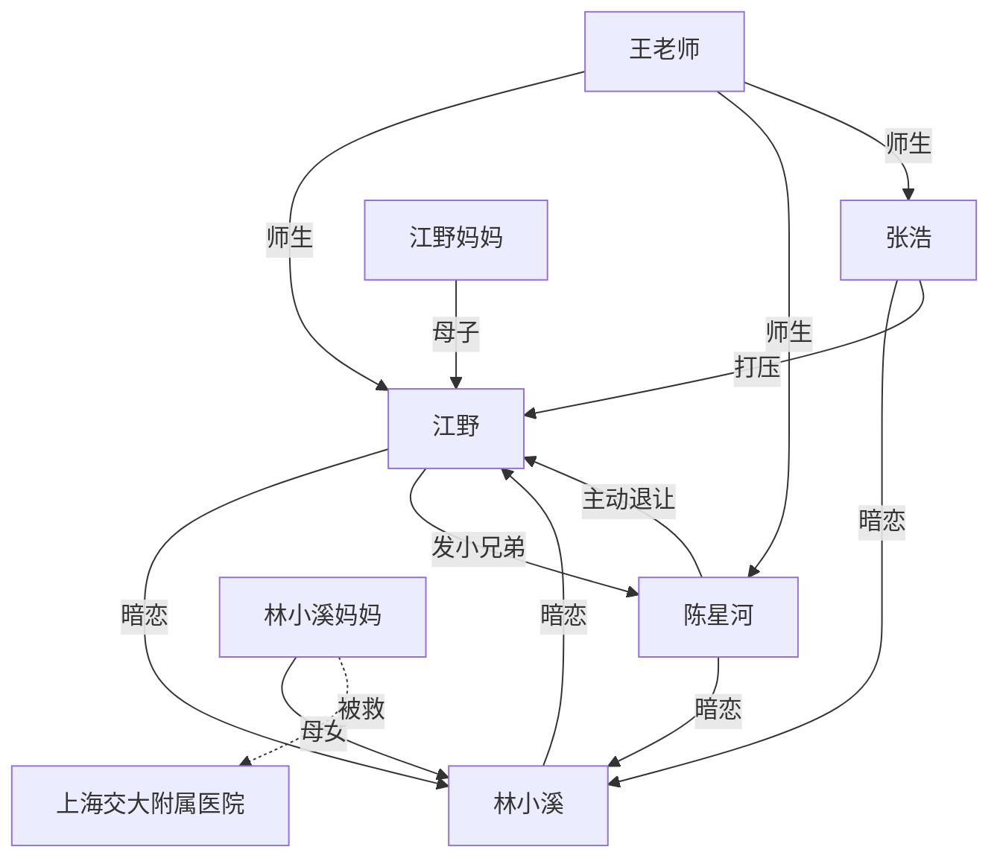

# 角色卡 ·《谁的青春不迷茫》

> 短剧《谁的青春不迷茫》· 校园群像表
> 主线：三条命运线在高考前 100 天拧在一起——学渣逆袭、暗恋、兄弟情。

---

## 江野（男主）

| 项 | 内容 |
| --- | --- |
| 年龄 | 18 岁，高三（理科） |
| 身份 | 原学渣、高三突然逆袭的"黑马"、江野妈妈独自抚养的独子 |
| 三个关键词 | 隐忍 / 深情 / 重诺 |
| 核心动机 | 考上北大，向林小溪证明自己；不让兄弟白牺牲 |
| 人物弧光 | 从"为兄弟牺牲" → "为自己而战" → "为并肩" |
| 口头禅 | "我请你吃烤肠。" |
| 标志性动作 | 摸鼻梁 / 把错题集翻到第 3 题 |
| 秘密 | 他从高一就注意到陈星河喜欢林小溪，3 年没说破 |
| 名场面 | EP01 击掌 / EP05 试卷真相 / EP10 高考作文 |

---

## 林小溪（女主）

| 项 | 内容 |
| --- | --- |
| 年龄 | 18 岁，高三（文科） |
| 身份 | 年级前 3，安静温柔，江野同桌 3 年 |
| 三个关键词 | 温柔 / 坚定 / 长情 |
| 核心动机 | 考上医学院，治好妈妈的病；和江野并肩 |
| 人物弧光 | 从"不敢说" → "我等你" → "并排走" |
| 口头禅 | "第 3 题，我等了 100 天。" |
| 标志性动作 | 把错题集放在江野桌洞 / 低头写字时抿嘴唇 |
| 秘密 | 第一志愿不是北大，是上海交大医学院（妈妈曾在那里被救） |
| 名场面 | EP01 暗恋曝光 / EP06 妈妈病情 / EP10 高考志愿 |

---

## 陈星河（男二 / 兄弟）

| 项 | 内容 |
| --- | --- |
| 年龄 | 18 岁，高三（理科） |
| 身份 | 江野发小 6 年、年级第一、单亲家庭长大 |
| 三个关键词 | 豪爽 / 细腻 / 牺牲 |
| 核心动机 | 让兄弟追到那个女孩；让自己不后悔 |
| 人物弧光 | 从"暗恋者" → "退让者" → "送嫁人" |
| 口头禅 | "滚去睡觉。" |
| 标志性动作 | 击掌 / 把东西藏在身后递过去 |
| 秘密 | 从高一写 3 年日记，记录林小溪的每个小动作；高一曾救过江野一次 |
| 名场面 | EP01 击掌 / EP07 日记 / EP10 高考志愿反转 |

---

## 张浩（T3 反派）

| 项 | 内容 |
| --- | --- |
| 年龄 | 18 岁，高三（理科） |
| 身份 | EP04 转校生、原年级第一、家庭优渥 |
| 三个关键词 | 傲慢 / 嫉妒 / 极端 |
| 核心动机 | 赢过所有人，证明"黑马不过是运气" |
| 人物弧光 | 从"打压者" → "掉包者" → "心态崩" |
| 口头禅 | "黑马？" |
| 标志性动作 | 推眼镜 / 嘴角冷笑 |
| 秘密 | EP04 起揭示，他也喜欢林小溪 |
| 名场面 | EP04 转学 / EP05 掉包试卷 / EP09 失眠 |

---

## 王老师（次要角色）

| 项 | 内容 |
| --- | --- |
| 身份 | 高三（1）班班主任，数学老师 |
| 三个关键词 | 严厉 / 公正 / 刀子嘴 |
| 核心动机 | 让每个学生都考上大学 |
| 关键场景 | EP01 集合念成绩 / EP05 调查掉包 / EP10 送考 |

---

## 江野妈妈（次要角色）

| 项 | 内容 |
| --- | --- |
| 身份 | 江野母亲，工厂工人，独自抚养江野 |
| 三个关键词 | 朴实 / 坚强 / 沉默 |
| 关键场景 | EP03 童年回忆 / EP10 送考时塞 100 块 |

---

## 林小溪妈妈（次要角色）

| 项 | 内容 |
| --- | --- |
| 身份 | 林小溪母亲，重病患者，曾在上海交大附属医院被救 |
| 三个关键词 | 温柔 / 病弱 / 优雅 |
| 关键场景 | EP06 病情揭露 / EP10 视频通话 |

---

## 关系图（Mermaid）

---

## CP 时间线

| 节点 | 集数 | 事件 | 糖虐比 |
| --- | --- | --- | --- |
| 错位暗恋 | EP01 | 兄弟同时为对方牺牲 | 虐 70% |
| 暗恋曝光 | EP01 | 林小溪承认暗恋江野 3 年 | 糖 100% |
| 兄弟击掌 | EP01 | 100 天约定一起考北大 | 糖 90% |
| 误会 | EP02 | 林小溪第一志愿不是北大 | 虐 60% |
| 错题集 | EP03 | 错题集每页都是告白 | 糖 100% |
| 反派登场 | EP04 | 张浩转学，嘲讽江野 | 虐 50% |
| 并肩 | EP06 | 江野决定陪小溪去上海 | 糖 80% |
| 退让 | EP07 | 陈星河交出 3 年日记 | 虐 70% |
| 承诺 | EP08 | 三人写下 100 天承诺书 | 糖 100% |
| 高考 | EP10 | 三人各自答卷 / 志愿揭晓 | 糖 100% + 彩蛋 |
