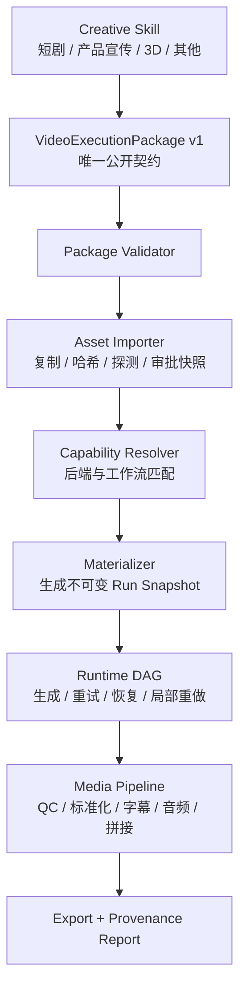

# LFO Runtime v1：创作 Skill 与视频执行引擎边界设计

**状态：** Proposed，等待实施  
**日期：** 2026-08-09  
**性质：** Breaking redesign，不兼容旧 `shots[]`、旧 Panel-only CLI、旧创作管线  
**关联计划：** `docs/plans/2026-08-09-lfo-runtime-v1-implementation-plan.md`

## 1. 结论

LFO 不再是“从小说到视频的一体化创作工作台”，而是一个稳定、可恢复、可审计的本地视频执行引擎。

- 故事设计、产品宣传结构、3D 动画方法、角色设计、黑白分镜和图片生成由可替换的 Agent Skill 负责。
- Skill 只向 LFO 提交一种公开契约：`VideoExecutionPackage`。
- LFO 负责素材导入、能力匹配、工作流物化、视频生成、重试恢复、质检、字幕、音频合成、拼接与导出。
- LFO 内核不理解“角色、场景、道具、2×4 分镜板、15 秒叙事节奏”等创作概念。
- 保留现有已经验证的运行时基础设施和算法，重写领域边界、公开契约及默认执行入口。

这是一项“保留基础设施的边界重写”，不是旧管线修补，也不是无差别全盘重写。

## 2. 目标与成功标准

### 2.1 目标

1. 任意创作 Skill 都能用同一份执行包调用 LFO。
2. Skill 不依赖 SQLite 表、ComfyUI 节点编号、模型路径、内部资产 ID 或引用槽位。
3. 更换图片生成 Skill、视频后端或创作平台时，不改变 LFO 的公共接口。
4. 每次执行都有不可变快照，可重试、恢复、局部重做并追溯输入、模型、参数和产物。
5. 视频、原生音频、外部音频、字幕和最终导出由一条确定的工程化流水线处理。

### 2.2 用户可感知的成功标准

- `lfo execute package.json` 能完成素材导入、视频生成、字幕、拼接和导出。
- 一个短剧 Skill、一个产品宣传 Skill 能提交不同创作内容但结构相同的执行包。
- 执行中断后可恢复，不重复提交已经成功且输入未变化的生成任务。
- 修改一个 Clip 后，只重做该 Clip 及受影响的后处理，不重做无关 Clip。
- 后端能力不满足时，在生成前给出明确原因，不静默换模型或降低质量。
- 最终输出能追溯到执行包版本、素材哈希、后端、工作流、模型、参数和每次尝试。

## 3. 明确边界

### 3.1 Skill 负责

- 理解小说、产品、品牌、世界观或其他创作输入。
- 决定内容结构、节奏、镜头、视觉风格和叙事策略。
- 生成并让用户审批故事概要、角色图、产品图、场景图、黑白分镜等创作资产。
- 生成最终视频提示词、对白、字幕文本、音乐意图及素材用途说明。
- 把创作结果适配成 `VideoExecutionPackage`。

### 3.2 LFO Runtime 负责

- 校验执行包及其版本。
- 安全导入外部图像、视频、音频、字幕和文档。
- 计算文件哈希、登记版本、审批快照和 provenance。
- 根据通用能力要求选择后端和工作流。
- 将语义素材引用物化为具体槽位、参数和内部资产 ID。
- 构建任务 DAG，执行视频生成并处理幂等、租约、重试、取消和恢复。
- 对生成结果进行技术质检、标准化、字幕处理、音频混合、拼接和导出。
- 保存运行报告和可复现信息。

### 3.3 不进入 LFO 内核

- 小说拆解、剧情创作、广告脚本、3D 叙事方法。
- 角色、场景、道具、产品等业务枚举。
- 2×4 分镜板规则、Panel 密度算法、固定 15 秒创作策略。
- 图片生成模型的创作控制。
- TTS 文案创作、声音选角、BGM 选曲。
- 为旧 `shots[]`、旧模板和旧 CLI 保留兼容路径。

## 4. 总体架构



公开模型只有 `VideoExecutionPackage`。Skill 内部可以使用 `CreativePanelSpec`，LFO 内部可以使用物化模型，但两者都不是公共 API。

## 5. 核心领域语言

| 名称 | 含义 | 是否公开 |
|---|---|---|
| Package | Skill 提交的一次完整视频执行意图 | 是 |
| Asset | 输入或输出媒体文件的不可变版本 | Package 中使用逻辑 ID |
| Clip | 最小视频生成与局部重做单元 | 是 |
| Reference | 某个 Clip 使用的输入素材 | 是 |
| BindingPolicy | 素材如何参与后端输入的机械规则 | 是 |
| Run | 某一 Package revision 的一次执行 | 否 |
| Materialization | 已解析后端、工作流、素材和参数的不可变执行快照 | 否 |
| Task | DAG 中的执行步骤 | 否 |
| Attempt | Task 的一次实际提交 | 否 |
| Review | 对确定内容哈希的审批或拒绝 | 否 |
| Export | 对一组已批准产物的最终封装 | 否 |

`Panel` 不属于 LFO 核心领域。Skill 可通过 `source_context` 记录 `panel_id`，但 LFO 只执行 Clip。

## 6. 唯一公开契约：VideoExecutionPackage v1

### 6.1 顶层结构

```json
{
  "schema": "lfo.video-execution.v1",
  "package_id": "demo-episode-001",
  "revision": 1,
  "project": {
    "title": "示例项目",
    "locale": "zh-CN"
  },
  "assets": [],
  "clips": [],
  "timeline": {},
  "output": {},
  "approval": {},
  "extensions": {}
}
```

### 6.2 AssetSpec

```json
{
  "asset_key": "hero.identity.front",
  "media_type": "image",
  "source": {
    "uri": "assets/hero.png",
    "sha256": null
  },
  "provenance": {
    "source_type": "external_skill",
    "producer": "codex.imagegen",
    "producer_version": null,
    "operation": "image.generate",
    "source_asset_keys": [],
    "prompt_hash": null
  },
  "review": {
    "required": true
  },
  "metadata": {}
}
```

规则：

- `asset_key` 只在 Package revision 内唯一，不是数据库 ID。
- v1 本地文件 URI 默认相对于 Package 文件目录解析。
- 导入后复制到 LFO 管理的内容寻址存储；运行时不继续依赖原始路径。
- `sha256` 可由 Skill 提供用于完整性校验；未提供时由 LFO 计算。
- `provenance.operation` 是开放字符串，不使用封闭的创作方法枚举。
- 审批绑定导入后的文件哈希与相关元数据哈希；文件变化后审批自动失效。

### 6.3 ClipSpec

```json
{
  "clip_id": "clip-001",
  "sequence": 1,
  "duration_ms": 15000,
  "generation": {
    "operation": "video.reference_to_video",
    "prompt": "最终确认的视频提示词",
    "negative_prompt": null,
    "seed": null,
    "requirements": {
      "aspect_ratio": "9:16",
      "width": 1080,
      "height": 1920,
      "fps": 24,
      "native_audio": "allowed"
    },
    "references": []
  },
  "audio": {},
  "subtitles": {},
  "dependencies": [],
  "source_context": {
    "skill": "zero-to-story",
    "panel_id": "panel-001"
  },
  "extensions": {}
}
```

`duration_ms` 是执行参数而不是固定策略。不同 Skill 可提交任意后端允许的时长。

### 6.4 ReferenceSpec 与 BindingPolicy

```json
{
  "reference_id": "ref-001",
  "asset_key": "hero.identity.front",
  "semantic_usage": "subject.identity",
  "instruction": "保持主体身份、发型和服饰一致",
  "binding": {
    "required": true,
    "priority": 100,
    "placement": "any",
    "on_unsupported": "fail"
  }
}
```

关键决策：

- `semantic_usage` 是可扩展标签，LFO 不枚举角色、产品或道具。
- `instruction` 由 Skill 提供，可进入后端提示词。
- `binding` 明确描述执行行为，LFO 不从语义标签猜测优先级和槽位。
- `placement` v1 支持 `any`、`first`、`last`、`fixed`；`fixed` 需要 `slot`。
- `on_unsupported` v1 支持 `fail` 和 `drop`；必需引用不能设置为 `drop`。
- 超过后端上限时只允许删除 `required=false` 的引用，并按 priority 从低到高处理。

### 6.5 音频与字幕

Clip 音频策略必须区分视频后端原生音频与外部轨道：

```json
{
  "native_audio": "preserve",
  "tracks": [
    {
      "asset_key": "dialogue.clip-001",
      "role": "dialogue",
      "offset_ms": 0,
      "gain_db": 0,
      "fade_in_ms": 0,
      "fade_out_ms": 100,
      "duck_group": "foreground"
    }
  ]
}
```

`native_audio` 支持 `preserve`、`mute`、`mix`、`replace`。Skill 决定策略，LFO 负责确定性执行。

字幕支持两种输入：

- 已定时 cues：LFO 直接生成 SRT/VTT 或烧录。
- 外部字幕资产：LFO 校验并复制到导出物。

v1 不根据未定时文本自动推断复杂对白时序，也不内置 TTS 或音乐生成。

### 6.6 OutputPolicy

输出策略至少包含：

- 容器与视频编码器。
- 目标分辨率、比例、fps 和色彩空间。
- 音频编码、采样率及响度目标。
- Clip 间转场或直接拼接。
- 字幕为 sidecar、burn-in 或两者。
- 文件命名和导出目录逻辑名称。

所有输出路径由 LFO 生成，Package 不允许指定任意绝对写入路径。

### 6.7 Approval

Package 中的 `approval` 只是 Skill 的创作确认声明，不能代替 LFO 内部审批记录。

LFO 的执行审批必须绑定：

- Package canonical hash。
- Package revision。
- 所有 required 输入 Asset 的文件哈希。
- 最终 prompt 和 output policy 哈希。
- 审批时间与审批来源。

任一绑定内容变化后，审批失效并阻止提交。未来可允许受信任 Skill Adapter 自动创建审批记录；v1 默认显式确认或明确的 `--approve`。

### 6.8 Extensions

- 扩展键必须使用命名空间，例如 `zero-to-story.storyboard_cell_ids`。
- 未识别扩展默认保存并忽略，不能影响核心执行语义。
- 需要影响执行的字段必须进入正式 Schema，不能依赖扩展暗中改变行为。

## 7. 能力协商与工作流选择

### 7.1 CapabilityManifest

每个后端/工作流 revision 必须声明：

- 支持的 operation。
- 输入媒体类型和最大引用数。
- 引用槽位与 placement 能力。
- 时长范围、帧数公式和 fps 范围。
- 分辨率、比例和像素约束。
- 是否生成原生音频。
- seed、确定性和可复现等级。
- 所需模型、节点、服务和环境要求。
- 输出媒体签名。

H3 的 `17k+5` 帧规则、3/9 引用槽位、分辨率和 24fps 都属于具体 Manifest，不进入通用 validator。

### 7.2 选择规则

1. 过滤不支持 operation 或 required reference 的候选。
2. 检查时长、帧、分辨率、音频和环境能力。
3. 根据 Package 的显式后端偏好与本机状态排序。
4. 生成选择解释，包括所有被排除候选及原因。
5. 物化后锁定 backend revision、workflow hash 和模型解析结果。

v1 不做静默自动降级。若用户显式提供 fallback policy，才允许按顺序尝试；涉及质量、成本、音频能力或输入丢失的变化必须重新确认。

## 8. 物化与可复现性

`MaterializedRunSnapshot` 是执行前生成的不可变内部记录，至少包含：

- Package canonical JSON 和 hash。
- 所有导入资产的内部 ID、文件哈希、媒体探测结果和审批 revision。
- 每个 Clip 选择的 backend/workflow/provider revision。
- 最终 reference 槽位、丢弃原因和 prompt snapshot。
- 解析后的模型、参数、帧数、分辨率、seed。
- 环境快照及 execution hash。
- 输出策略和 DAG 版本。

执行任务只读取该快照，不直接读取可变的 Package 文件或源素材路径。

可复现性标记分为：

- `exact`：相同二进制、确定性后端和参数可精确复现。
- `best_effort`：保存完整参数，但后端或模型不保证确定性。
- `non_reproducible`：缺少关键版本或后端不可固定；默认不允许无人值守生产运行。

## 9. 状态模型

避免把任务执行、提交、审批和导出塞进一个枚举。使用分层状态：

### 9.1 Run

`ACCEPTED → IMPORTING → PLANNING → READY → RUNNING → WAITING_REVIEW → EXPORTING → COMPLETED`

终止状态：`FAILED`、`CANCELLED`、`SUPERSEDED`。

### 9.2 Task

`BLOCKED → READY → RUNNING → SUCCEEDED`

分支状态：`FAILED_RETRYABLE`、`FAILED_TERMINAL`、`STALE`、`CANCELLED`。

### 9.3 Attempt

`CREATED → SUBMITTING → SUBMITTED → RUNNING → SUCCEEDED`

分支状态：`FAILED`、`UNKNOWN`、`CANCELLED`。

`UNKNOWN` 用于提交结果不确定，恢复逻辑必须先 reconcile，不能直接重复提交。

### 9.4 Review

`PENDING → APPROVED | REJECTED | INVALIDATED`

Review 是独立记录，不使用 Task 的 `APPROVED` 状态。

### 9.5 Export

`PENDING → ASSEMBLING → VALIDATING → READY`

分支状态：`FAILED`、`SUPERSEDED`。

现有 SQLite WAL、CAS、transition journal、lease、retry budget 和 recovery 算法应保留并适配该分层模型。

## 10. 局部重做、取消与恢复

### 10.1 失效范围

失效事件必须结构化：

- `regenerate_clip`
- `re_qc_clip`
- `remix_audio`
- `regenerate_subtitles`
- `reassemble_timeline`
- `reexport`

例如修改 Clip 2 的 prompt：Clip 2 生成任务、Clip 2 QC、总时间线和导出失效；Clip 1 和 Clip 3 的生成产物保持有效。

### 10.2 取消传播

- 取消 Run：停止新任务入队，尝试取消已提交任务，将未开始任务标记取消。
- 取消 Clip：取消该 Clip 的下游任务，并使总时间线进入 blocked/partial 状态。
- 已产生且哈希有效的资产保留，不做破坏性删除。

### 10.3 恢复

- 对有远端/Comfy task ID 的 UNKNOWN Attempt 先查询后端。
- 只有确认未提交或确认失败才允许创建新 Attempt。
- 成功输出经哈希与技术 QC 后才能提交 Task 成功状态。

## 11. 素材安全与存储

### 11.1 输入

- 相对路径以 Package 所在目录为根。
- 默认拒绝网络 URL；后续由独立下载 Provider 支持。
- 解析真实路径并防止 `..`、符号链接或 junction 越出允许读取范围。
- 不原地修改用户素材。
- 通过文件头和媒体探测识别类型，不只信扩展名。
- 设置文件大小、像素、时长和解码资源上限。

### 11.2 内容寻址存储

导入后复制到：

```text
workspace/assets/sha256/<前两位>/<完整 sha256>/<原始安全文件名>
```

数据库保存 logical asset、asset revision、blob hash、媒体签名和 provenance。相同文件可复用 blob，但审批和逻辑绑定分别版本化。

### 11.3 输出

- 所有中间文件和最终文件由 Workspace 服务生成路径。
- FFmpeg/ffprobe/ComfyUI 调用使用参数数组，不拼接 shell 字符串。
- 最终导出采用临时文件写入、QC 成功后原子替换。
- 日志不得输出凭据、完整环境变量或不必要的私人绝对路径。

## 12. 音视频后处理边界

LFO 内核固定的是确定性媒体操作，而不是创作决策：

- 视频探测、裁剪、缩放、补帧策略执行和编码标准化。
- 保留、静音、替换或混合原生音频。
- 外部对白、环境声、音效、BGM 的时间轴对齐和混音。
- 响度、峰值、采样率和声道标准化。
- SRT/VTT 生成、字幕烧录或 sidecar 导出。
- Clip 拼接、转场执行、最终 QC 和报告。

Skill 决定使用何种素材和创作意图；LFO 不生成对白内容、不选音乐、不决定视觉节奏。

## 13. 保留、重写与删除

### 13.1 原则上保留并适配

- `src/lfo/core/` 中的 SQLite、CAS、hashing、retry、recovery、lease 和 workflow registry 基础能力。
- `src/lfo/comfy/` 的客户端、提交、监控和收集。
- `src/lfo/environment/` 的环境发现与快照。
- `src/lfo/assembly/` 和通用媒体服务。
- 技术 QC、lineage、report 中与创作类型无关的部分。

### 13.2 重写

- 公开 Schema 与 Python facade。
- Asset import、Package approval 和 materialization。
- `visual/capabilities.py` 的固定 boolean 能力模型。
- `planning/panel_pack.py` 的角色/场景/道具结构。
- `planning/validator.py` 与 `pipeline_service.py` 中的 H3 硬编码。
- 默认 CLI 与 PipelineService。
- 状态聚合与失效范围。

### 13.3 新链路通过后删除或移出默认包

- 小说 intake/decompose 和创作提示模板。
- CharacterSheetService、StoryboardPreviewService 及内部生图阶段。
- 旧 `images`、`preview`、`panels` 创作 CLI。
- Storyboard/Beat/Panel 到视频任务的默认编排。
- 固定 character/scene/prop purpose、role 和 capability。
- 旧模板驱动的完整执行入口。

删除必须发生在新链路端到端通过之后；不做长期双轨，但允许开发期间短暂并存以降低重构风险。

## 14. Python 与 CLI 接口

### 14.1 Python

```python
from lfo import VideoRuntime

run = VideoRuntime().execute("execution-package.json")
print(run.run_id)
```

补充接口：

- `validate(path)`：仅校验 Schema、路径和能力要求，不导入或执行。
- `plan(path)`：导入素材并生成可审阅物化计划，不提交生成。
- `execute(path, approval=...)`：创建或恢复 Run。
- `status(run_id)`、`retry(run_id, scope=...)`、`cancel(run_id)`。
- `review(run_id, target, decision)`。
- `export(run_id, policy_override=None)`。

### 14.2 CLI

```text
lfo validate <package.json>
lfo plan <package.json>
lfo execute <package.json> [--approve]
lfo status <run_id>
lfo retry <run_id> [--clip <clip_id>] [--scope <scope>]
lfo cancel <run_id> [--clip <clip_id>]
lfo review <run_id> --target <target> --approve|--reject
lfo export <run_id>
lfo doctor
```

`run <storyboard.json>`、内部创作命令和旧 Panel-only 命令不保留兼容别名。

## 15. v1 范围

### 15.1 v1 必须支持

- 本地 JSON Package。
- 本地图像、视频、音频和字幕导入。
- T2V、I2V、首尾帧、R2V 等由 Manifest 声明的视频 operation。
- 单机本地 ComfyUI/H3 执行。
- Clip 级 DAG、幂等、重试、恢复、取消和局部重做。
- 技术 QC、标准化、外部音轨混合、SRT/VTT 和最终拼接导出。
- 完整运行快照和 provenance 报告。
- `zero-to-story` Skill Adapter 示例与一个非故事型示例 Package。

### 15.2 v1 非目标

- 远程多机调度和云任务队列。
- 自动 TTS、音乐或图片生成。
- 多用户权限与协作编辑。
- 任意网络 URL 下载。
- 静默后端降级和自动花费决策。
- 旧数据库、旧项目和旧 CLI 迁移。

## 16. 关键架构验收

以下任一项不满足，架构重构不得宣布完成：

1. 核心代码中不存在 `character/scene/prop/storyboard_frame` 等创作枚举。
2. LFO 可执行不包含 Panel、Beat 或 Storyboard 的产品宣传示例 Package。
3. H3 帧网格、引用上限、分辨率和音频能力只来自 Manifest。
4. Package 修改后会产生新的 canonical hash，并使旧审批或物化快照失效。
5. 外部素材导入后源文件删除，已计划 Run 仍可执行。
6. 中断后恢复不会对已确认提交的任务重复提交。
7. 修改单个 Clip 不会重做其他 Clip 的生成。
8. 最终视频、字幕、音轨和报告可追溯到 Package 与所有输入哈希。

## 17. 最终决策

采用“新公共契约 + 新执行入口 + 复用成熟底层”的方式实现：

- 不保持业务模型兼容。
- 不直接删除全部现有代码后从零重写。
- 在新模块中建立干净链路并复用成熟内核。
- 新链路通过真实 E2E 后，一次性删除旧创作路径和旧入口。

该方案在最终架构清晰度、实施风险和长期扩展性之间取得最佳平衡。
